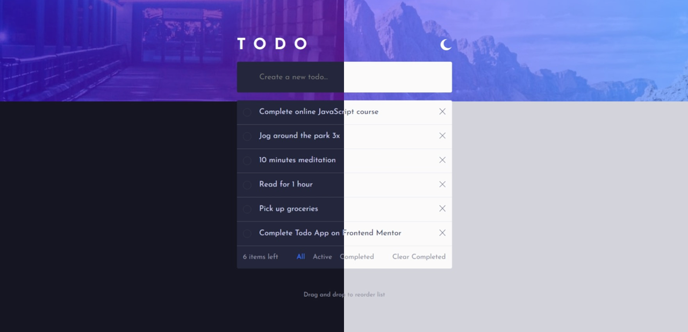

# Todo-list
Based on [frontendmentor.io](https://www.frontendmentor.io/challenges/todo-app-Su1_KokOW) project. Our main goal is, to make tasks more enjoyable to do by awarding users when they completed their work.

## Current functions
* **Login.jsx**
    * Nothing

* **Task.jsx**
    * Theme switch
    * Add a new task
    * Filter tasks by 'All', Incompleted ('Active'), and 'Completed'
    * Delete task
    * Drag and drop to reorder

---
## Updates
* **19/03**
    * Added MUI icons
    * Added sidebar
* **18/03**
    * Finished todo

---
## Next
* **Sidebar**
    * History, completed tasks will be shown here instead

